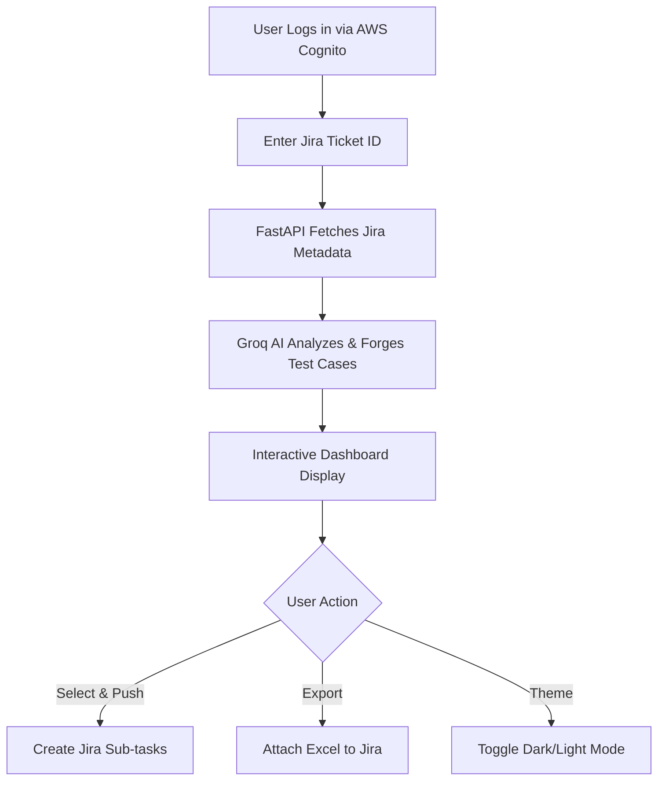

# <p align="center">🔥 QA Forge: The Digital Hammer of Quality 🔥</p>

<p align="center">
  
  
  
  
  
</p>

<p align="center">
  <b>Enterprise-Grade AI Manual Test Case Generator for Jira.</b><br>
  <i>Stop writing. Start forging.</i>
</p>

---

## 🌟 The Vision
**QA Forge** was born out of a simple frustration: QA Engineers spend more time documenting *how* to break things than actually breaking them. This platform leverages the raw power of **Groq LLMs** and **Stateless Security** to automate the most tedious part of the SDLC.

With QA Forge, you don't just "generate" test cases—you **forge** them with precision, speed, and enterprise-level reliability.

---

## 🚀 core capabilities

### 🧠 Neural Analysis Engine
Using high-density LLMs (Llama-3 via Groq), QA Forge analyzes complex Jira descriptions, identifying hidden edge cases and logic gaps that humans might miss. It outputs structured JSON that maps perfectly to your testing needs.

### 🛡️ Ironclad Security
No more local password storage. QA Forge utilizes **AWS Cognito Hosted UI** for a seamless, secure authentication flow. The backend employs RSA-signature verification on every single API call, ensuring that your company's Jira data stays exactly where it belongs.

### 🎟️ Deep Jira Integration
- **Smart Fetch**: Instantly pull ticket summaries and descriptions.
- **Auto-Subtasks**: One-click creation of Jira subtasks for every selected test case.
- **Excel Injection**: Generates formatted `.xlsx` test suites and attaches them directly to the parent ticket.

### 📱 Premium "Digital Forge" UI
A handcrafted interface featuring:
- **Glassmorphism**: Elegant blur effects and noise grids.
- **Amber Accents**: A high-contrast "forge" color palette.
- **Micro-interactions**: Smooth, staggered animations via Framer Motion.
- **Universal Responsiveness**: Pixel-perfect layout from mobile to 4K displays.

---

## 🛠️ The Workflow



---

## 🏗️ Technical Architecture

### Frontend Layer
- **React 18 + Vite**: For a lightning-fast development cycle and optimized production builds.
- **TypeScript**: Strict typing for zero-runtime-error stability.
- **AWS Amplify v6**: Handling the OIDC auth flow with PKCE security.
- **Framer Motion**: Orchestrating complex layout transitions.

### Backend Layer
- **FastAPI**: Asynchronous, high-performance Python framework.
- **Groq SDK**: Connecting to the world's fastest AI inference engine.
- **Python-Jose**: Handling high-speed RSA JWT validation.
- **Atlassian REST API**: Direct, authenticated communication with Jira.

---

## ⚙️ Setup & Installation

### Prerequisites
- Python 3.10+
- Node.js 18+
- AWS Cognito User Pool
- Jira API Token & Groq API Key

### Backend Installation
```bash
# Clone the repository
git clone https://github.com/RedSkull5143/qa-forge.git
cd qa-forge/backend

# Create & activate venv
python -m venv venv
source venv/bin/activate

# Install dependencies
pip install -r requirements.txt

# Configure .env
cp .env.example .env
# [Edit .env with your keys]

# Fire up the engine
python main.py
```

### Frontend Installation
```bash
cd ../frontend
npm install
npm run dev
```

---

## 🛣️ Roadmap: What's Next?
- [ ] **SQLite Persistence**: History of all forged test cases.
- [ ] **AI-Driven Bug Reports**: Generate bug tickets from failed test case results.
- [ ] **Custom Prompt Templates**: Tailor the "AI Brain" for specific project types.
- [ ] **Team Collaboration**: Shared workspace for QA teams.

---

## 👤 Author

**Om Shinde**  
*SDET*

[](https://github.com/RedSkull5143) 
[](https://www.linkedin.com/in/shindeom)

---

<p align="center">
  Proudly built with ❤️ for the QA Community.
</p>
